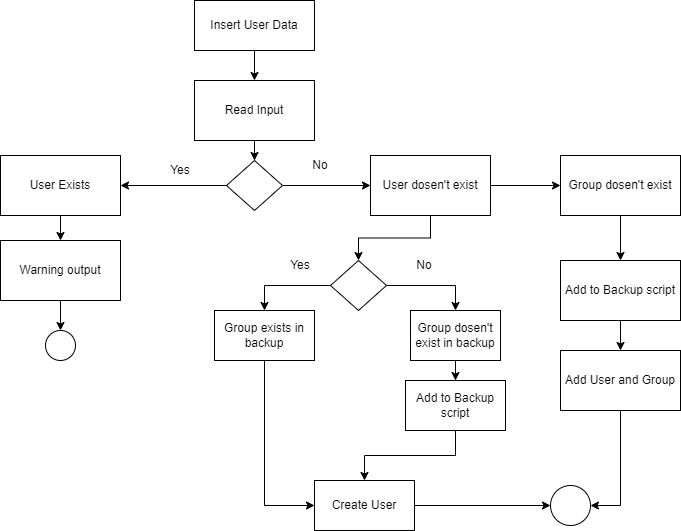
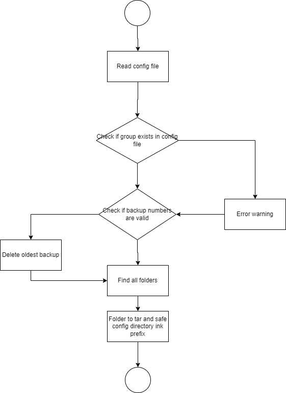

# Projekt Dokumentation

[[_TOC_]]

## Lösungsdesign
Anhand der Analyse wurde folgendes Lösungsdesign entworfen.

### Aufruf der Skripte

TODO: schreiben sie wie die Skripte aufgerufen werden sollen (d.h. welche Parameter werden übergeben, gibt es Interaktionen mit dem Skript, läuft es automatisch täglich ab?)

Die Scripte werden statisch aufgerufen

### Ablauf der Automation

#### Create User Activity Diagramm:
Dieses Activity Diagramm zeigt, wie erstellen eines Users verläuft.

#### Backup Activity Diagramm:
Dieses Activity Diagramm zeigt, wie man einen Backup verläuft.

### Konfigurationsdateien

TODO: Definieren sie welche Parameter in welchen Konfigurationsdateien gespeichert werden.

## Abgrenzungen zum Lösungsdesign

TODO: Nachdem das Programm verwirklicht wurde, hier die Unterschiede von der Implementation zum Lösungsdesign beschreiben (was wurde anders gemacht, was wurde nicht gemacht, was wurde zusaetzlich gemacht)